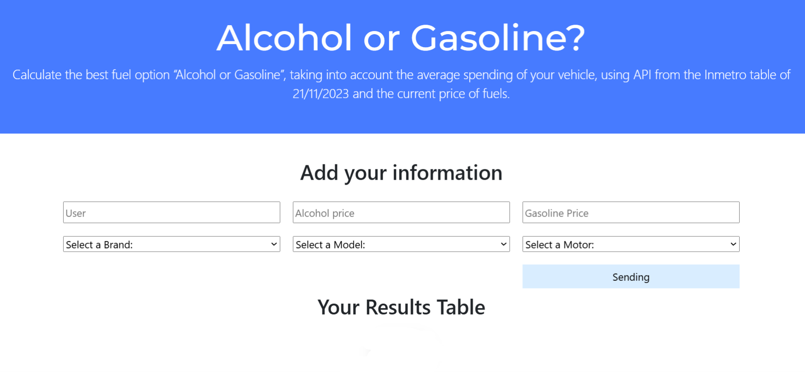
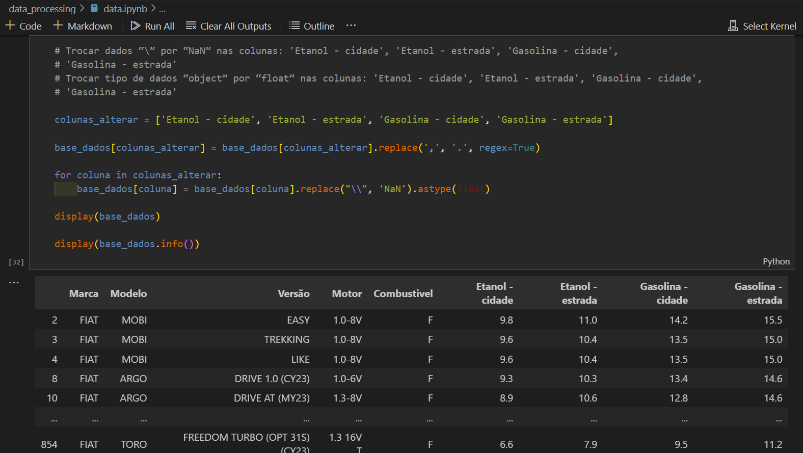
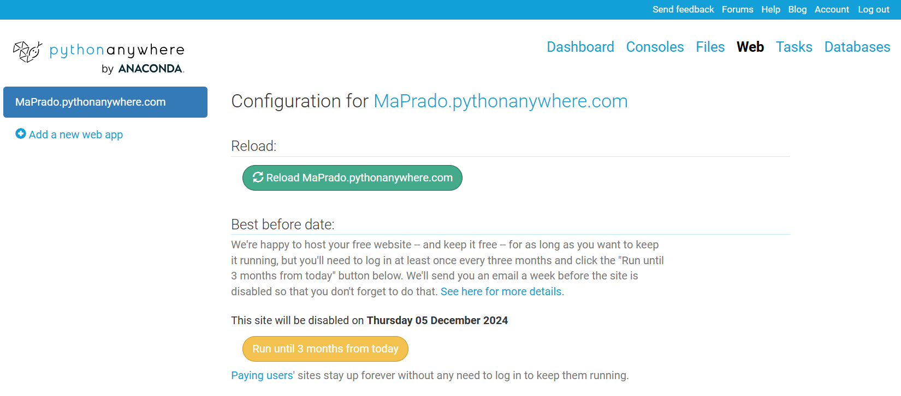
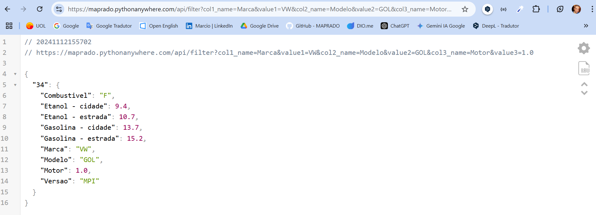
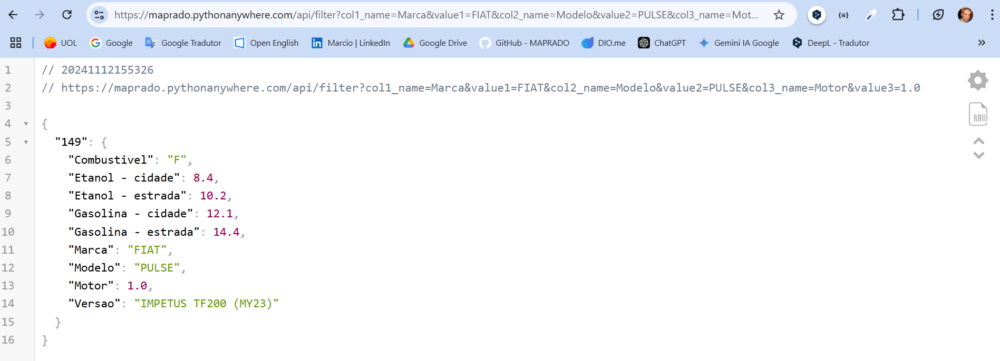
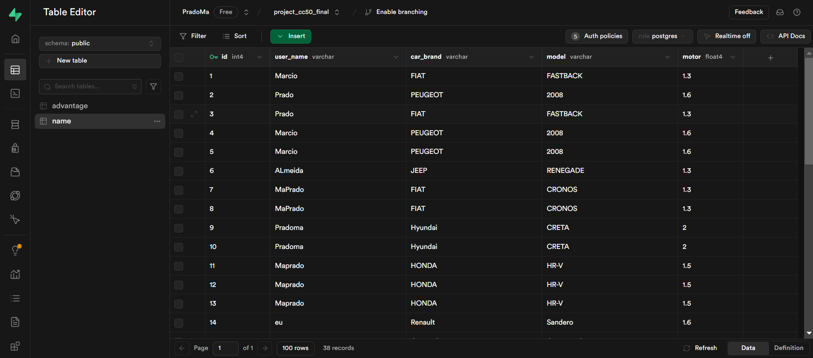
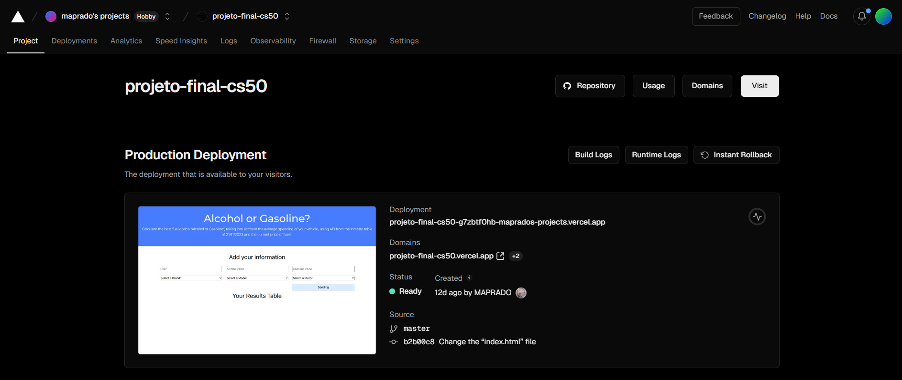
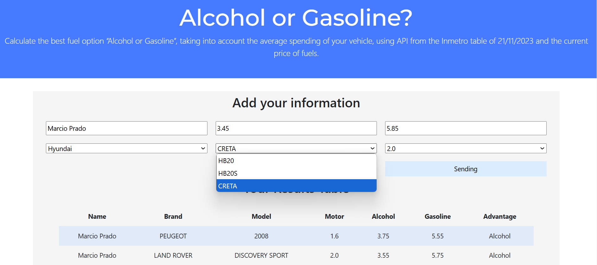

# Projeto Final do Curso CS50 Harvard

## Web Application - Gasolina x Álcool

### Objetivo

Uma página tipo aplicativo web, para calcular qual a melhor opção de combustível “Álcool ou Gasolina”, levando em consideração o gasto médio do veículo, utilizando uma tabela do Inmetro atualizada em 21/11/2023 e os valores de bomba inseridos no campo do formulário.  

O usuário vai fornecer os dados: nome, marca do carro, modelo, motor e valores de Álcool e Gasolina. O formulário envia os dados para o backend que faz a solicitação a API e localiza os valores de consumo médio do veículo. O backend calcula qual combustível é mais vantajoso.  

Então o sistema envia os dados para um banco de dados e em seguida apresenta esses dados numa tabela, na página do aplicativo.

**Home da aplicação** :point_down:


## Descrevendo os processos

### API

> A ideia era fazer a requisição dos dados de consumo médio do veículo para API do Inmetro, de acordo com as entradas do usuário.  
> Usar um framework para criar a aplicação web com python. E encontrar um servidor free para hospedar a API.  
> A API não é visualizada na aplicação web e funciona apenas no backend.

### Estrutura base do projeto

> A estrutura do Flask com Python, tem um esquema de organização de pastas específico que deve ser seguido.

```project/main.py
    project/.gitignore
    project/requirements.txt
    project/README.md
    project/static/js
    project/static/css
    project/static/images
    project/templates/files.html
```

### Banco de dados

> Usar a linguagem SQL, mais a ferramenta nativa do Python o “SQLite3”, de simples implementação. Posteriormente migrado para PostgreSQL.

## Impedimentos enfrentados

### API

> Não foi possível utilizar a API pública, por ser paga e necessitar de CNPJ, o que não é viável para um projeto pessoal.  
> Novamente encontrar um serviço que pudesse ser utilizado para hospedar a API e ser free, foi bem desafiador.  
> Como há muitas variáveis compondo a requisição via URL ou Query String, poderia ter muitos erros se os campos do formulário fossem abertos.

### Estrutura base do projeto

> O servidor onde irá hospedar a aplicação pode ter regras próprias, que podem gerar conflito como foi o caso do Firebase.

### Banco de dados

> O Vercel não aceita banco de dados porque os ambientes de hospedagem(Vercel) são executados em algo chamado armazenamento efêmero. O armazenamento efêmero é apenas temporário, é uma instância que pode ser executada e depois encerrada. Quando encerrado, todos os dados são redefinidos para o que estava na compilação original.

## Resoluções encontradas

### API

> A opção foi baixar uma tabela(PDF), converter para excel e tratar os dados da planilha do Inmetro de NOV/2023 no Jupyter Notebook(Python). Utilizar o processo ETL (Extract, Transform, Load), o tratamento teve limpeza dos dados tratando colunas com informações vazias, removendo duplicatas e garantindo a consistência. Eliminando colunas que não tem rótulos, realizando as transformações necessárias por exemplo, conversão de tipos de dados, tratar caracteres especiais. Criando assim um data frame e exportando em excel para fazer a API do zero.  
> O framework escolhido para criar a API foi o Flask, utilizando URL’s dinâmicas para cada entrega. O servidor escolhido para hospedar a API foi o PythonAnywhere.  
> Foi utilizado dropdown com seleção em cascata ou vinculada, para minimizar os erros de digitação, uma vez que são 3 campos combinados para localizar o veículo e o volume de erros poderia passar a impressão de falha na API.

**Tratando os dados no Jupyter Notebook** :point_down:


### Estrutura base do projeto

> Abandonar o Firebase no meio do projeto e buscar outros servidores free. Heroku, Render e por fim adotar o Vercel.  
> Estrutura usada de acordo com o padrão do Flask.

### Banco de dados

> Por isso o banco de dados do projeto foi migrado do “SQLite3” para “PostgreSQL”. E foi definido não subir o banco de dados junto com a aplicação no Vercel, por não ser um servidor persistente. Assim como a API foi implementada em uma outra plataforma, o “PythonAnywhere”, subimos o novo banco de dados no “Supabase”.

## Back-end da Aplicação

### PythonAnywhere

Arquivo `api_inmetro.py` que cria e configura a API no PythonAnywhere.

**Interface da plataforma** :point_down:


### Requisição via URL ou Query String

Alguns exemplos de requisições a API, utilizando as variáveis reais da base.  
Importante que a API funciona em segundo plano, porque as variáveis são definidas no formulário dropdown com seleção vinculada evitando erros, uma vez que a base não possui todos os carros existentes no mercado, apenas os carros zero km ano 2023, que são Flex.

[https://maprado.pythonanywhere.com/api/filter?col1_name=Marca&value1=VW&col2_name=Modelo&value2=GOL&col3_name=Motor&value3=1.0](https://maprado.pythonanywhere.com/api/filter?col1_name=Marca&value1=VW&col2_name=Modelo&value2=GOL&col3_name=Motor&value3=1.0)

**Resultado no navegador** :point_down:


[https://maprado.pythonanywhere.com/api/filter?col1_name=Marca&value1=FIAT&col2_name=Modelo&value2=PULSE&col3_name=Motor&value3=1.0](https://maprado.pythonanywhere.com/api/filter?col1_name=Marca&value1=FIAT&col2_name=Modelo&value2=PULSE&col3_name=Motor&value3=1.0)

**Resultado no navegador** :point_down:


### Supabase com PostgreSQL

Arquivo `create_new_bank.py` que cria um banco de dados e adiciona as tabelas e suas colunas no PostgreSQL.

**Interface da plataforma** :point_down:


### Vercel Implantação em Produção

Arquivo `app_web.py` que cria as 3 rotas das URL´s dinâmicas, com suas funções onde o "/" é a home(index) da aplicação, "/requisition" é onde recebemos os dados dos formulários, fazemos as queries a API e recebemos a resposta. "/delivery" fazemos a conexão com o banco de dados, tratamos a resposta da API e adicionamos ao banco de dados, selecionamos as informações no banco de dados e apresentamos na tabela da aplicação web.

**Interface da plataforma** :point_down:


### Aplicação retornando os Dados na Tabela

Arquivo `main_application.py` responsável por receber os dados do formulário e da API, fazer os cálculos na função e retornar qual é o combustível mais vantajoso.

**Interface da aplicação** :point_down:


## Link para Aplicativo "Álcool ou Gasolina"

> [**Link direto para o aplicação**](https://projeto-final-cs50.vercel.app/)

## Technology Badges

### Databases


### Frameworks, Platforms and Libraries


### Hosting/SaaS


### IDEs/Editors


### Languages


### Version Control

[](https://git-scm.com/doc)
[](https://docs.github.com/)
